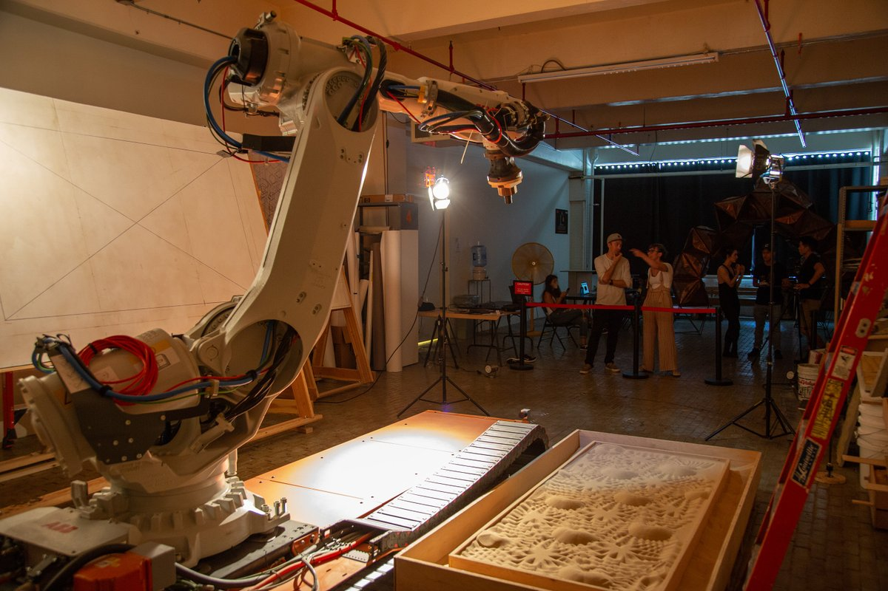
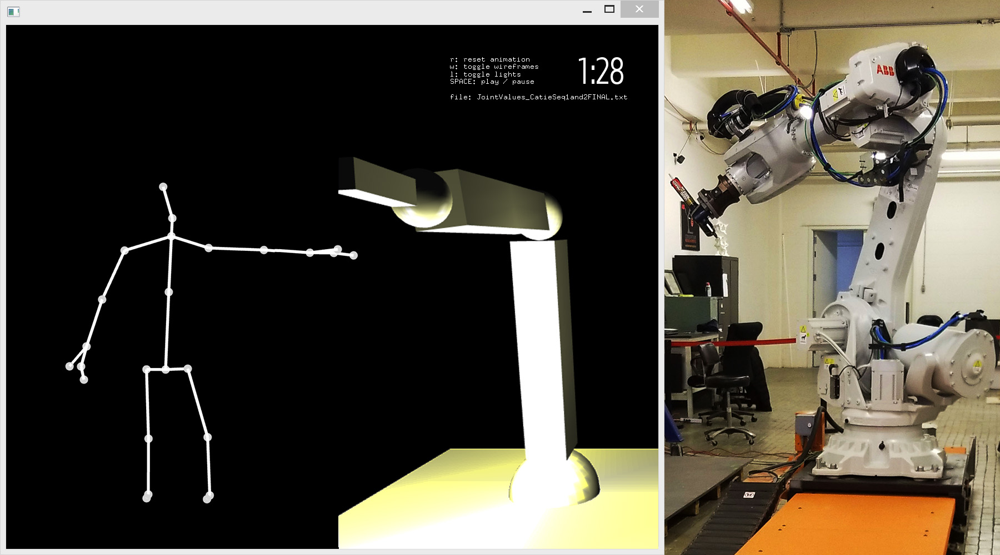

concat
======
A tool for visualizing robot movements alongside human movements. The concat system displays a depth skeleton from Kinect2 alongside a 3D rendering of data from an [ABB IRB 6700 industrial robot arm](https://new.abb.com/products/robotics/industrial-robots/irb-6700).

This codebase was developed to support artist Catie Cuan as part of [her residency at ThoughtWorks Arts](https://thoughtworksarts.io/bio/catie-cuan/). It runs on openFrameworks and requires a KinectV2 depth sensor.

Project dependencies
--------------------
- [ofxOSC](https://github.com/openframeworks/openFrameworks/tree/master/addons/ofxOsc) (part of the openFrameworks core)
- [ofxKinectV2-OSC](https://github.com/microcosm/ofxKinectV2-OSC/commit/3d9bce120262f006cc11ae834c0cb22e510c1de3)
- [ofxAnimatable](https://github.com/armadillu/ofxAnimatable/commit/2fdb0773911525171dc7f782e855472bbf1bb1f2)
- Tested against [openFrameworks 0.10.0](http://openframeworks.cc/download/)